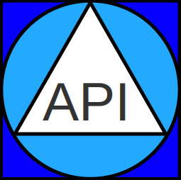
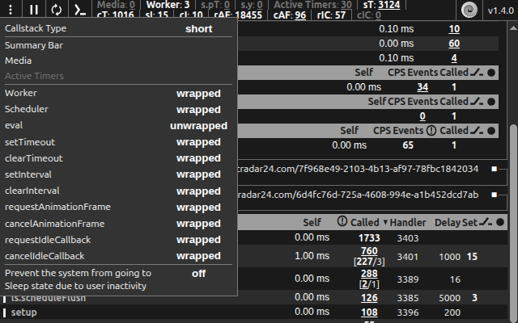
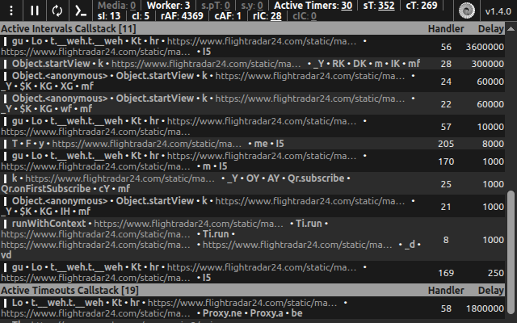

#  Browser API Monitor

- Available in Chrome Web Store as [API Monitor](https://chromewebstore.google.com/detail/api-monitor/bghmfoakiidiedpheejcjhciekobjcjp)

If you're web developer and want to assess implementation correctness - this tool adds additional panel to the browser’s DevTool that enables to see scheduled timeouts and active intervals, as well as to review and navigate to initiators of: eval, setTimeout, setInterval, requestAnimationFrame, requestIdleCallback and their terminator functions.

#### Allows:

- to measure callback execution self-time.
- to see `requestAnimationFrame` callback request frame rate.
- visit every function in the call stack (if available), bypass or pause while debugging.
- detect eval ­function usage, see its argument and return value, same for setTimeout and setInterval when called with a string instead of a function.
- for every mounted video or audio media element's to see it’s state and properties.

#### Helps to spot:

- incorrect timeout delay.
- bad handler for terminator function.
- terminating non existing or elapsed timeout.

#### Motivation:

- To expedite issues discovery.

#### Wrapped native functions:

- eval (by default off)
- setTimeout
- clearTimeout
- setInterval
- clearInterval
- requestAnimationFrame
- cancelAnimationFrame
- requestIdleCallback
- cancelIdleCallback

##### Note:

- while measuring performance of your code – consider disabling this extension as it may affect the results.

<details>
  <summary> <strong>Example</strong> </summary>




</details>

### Build requirements

- OS: Linux
- Node: 22.12.0 (LTS)
- Deno: 2.1.7

### Build instructions

```bash
make install  # install dependencies
make dev      # build in development mode and watch for changes
make prod     # build in production mode and make extension.chrome.zip
```
