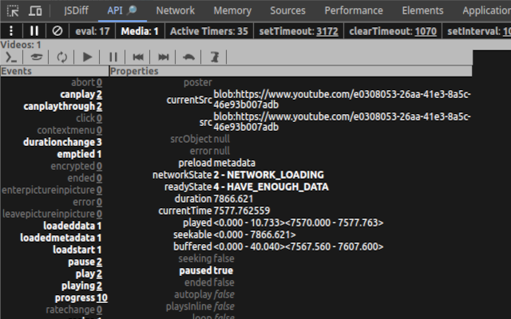
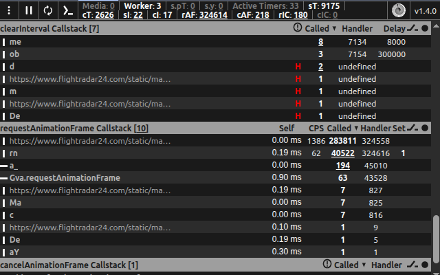

#  Browser API Monitor

- Available in Chrome Web Store as [API Monitor](https://chromewebstore.google.com/detail/api-monitor/bghmfoakiidiedpheejcjhciekobjcjp)

Whether you're developing a Single Page Application (SPA) and want to assess implementation correctness or are curious about how something works, this tool adds additional functionality to the Chrome browser DevTools to reveal active or passed timeouts, intervals, and `eval` usages while mapping their invocation call stacks to a source code location. If the page has mounted `video` or `audio` media element's, their events and property state changes can be observed as they happen ([documentation](https://developer.mozilla.org/docs/Web/API/HTMLMediaElement), [example](https://www.w3.org/2010/05/video/mediaevents.html)).

### Motivation

To expedite issues discovery, here are some examples from experience:

- A ~10ms delay interval constantly consuming approximately 10% of CPU from a third-party library, solely to check if the page was resized.
- A bundled dependency library that utilizes the eval function, thereby preventing the removal of `unsafe-eval` from the Content Security Policy (CSP) header. It can be arguably intentional, but also may reveal a configuration issue when the package was bundled with webpack config's [devtool: 'eval'](https://webpack.js.org/configuration/devtool/) in production mode.
- A substantial number of hidden video elements in the DOM that were consuming resources, unexpectedly limited to 100 medias per domain.
- An unattended interval that was unintentionally left running and contributed to a slowly growing memory.

To explore the internals of a complex systems.

<details>
  <summary> <strong>Example</strong> </summary>





</details>

### Build requirements

- OS: Linux
- Node: 20.11.1 (LTS)

### Build instructions

```bash
make install  # install dependencies
make dev      # build in development mode and watch for changes
make prod     # build in production mode and make extension.chrome.zip
```
