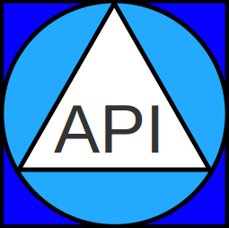
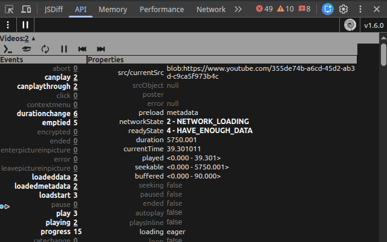
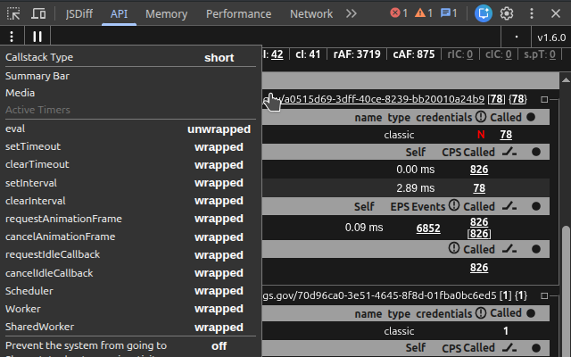
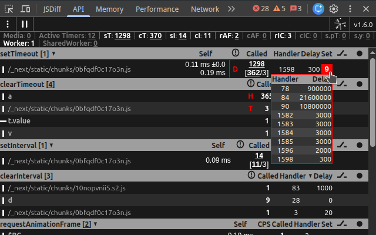
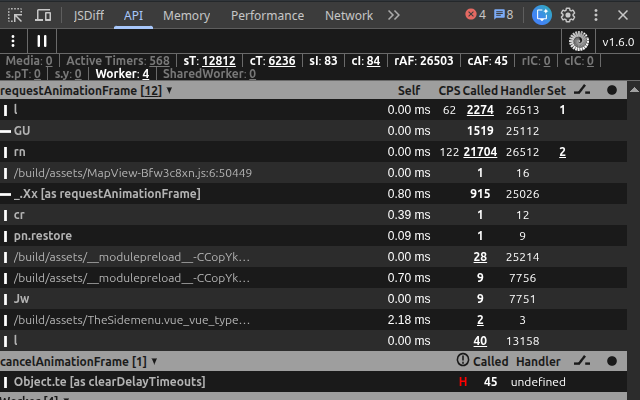

##  API Monitor - Chrome Developer Tools extension - API panel

Inspect scheduled timeouts, animation frames, idle callbacks, eval invocations, media, workers, scheduler API.
- Available in Chrome Web Store as [API Monitor](https://chromewebstore.google.com/detail/api-monitor/bghmfoakiidiedpheejcjhciekobjcjp)

### Motivation

To assess web application implementation correctness and to expedite issues discovery by gathering every bit of useful information from the usage of certain native APIs that are prone to human errors that are otherwise difficult to spot intuitively, [for example](./doc/issues.log.md).

### Specification

- Gather callstack that is used to call every wrapped function:
  - Identify the origin of the callstack domain.
  - Allow choosing the length of the collected trace:
    - **short** - just the nearest initiator (default).
    - **full** - from the root to the nearest initiator (from left to right).

- Aggregate information about currently scheduled timeouts and intervals.

- Gather details about which cancellation methods are cancelling those scheduled setters:
  - `setTimeout`, `setInterval`, `requestAnimationFrame`, `requestIdleCallback`.

- Allow bypassing invocation of a tracked function or its callback, if it has one.

- Allow pausing before a tracked function or its callback invocation by redirecting the code flow to a *debugger* breakpoint.
  - **Once paused**: hit "Step Inside" (<kbd>F11</kbd>) twice.
  - **Once done**: the safest scenario to exit from the "custom" debugging session, especially if it's a hot path, - is to:
    - hit "Deactivate breakpoints" (<kbd>Ctrl+F8</kbd>).
    - hit "Resume script execution" (<kbd>F8</kbd>).
    - then unset that originaly ordered breakpoint in the `API` panel.
    - hit "Activate breakpoints" again (return focus to `Sources` panel then <kbd>Ctrl+F8</kbd>).

- Calculate the execution time of an event listener or callback.
  - Warn if it exceeds 4/5 (13.33ms) of 60 FPS hardcoded frame-rate (16.66ms).
  - In extended view mode, show mean, standard deviation, and maximum values.

- Count calls per second (CPS) where it's rational.

- Detect when incorrect timeout/delay parameters are passed to `setTimeout`, `setInterval`, `requestIdleCallback`, `scheduler.postTask`.

- Detect when the cancellation function handler is a non-positive integer, or belongs to a non-existent/elapsed setter.

- Detect when timeouts are cleared with `clearInterval`, or intervals are cleared with `clearTimeout`.

- Detect `eval` function usage in runtime, as well as `setTimeout` and `setInterval` when called with a `string` callback instead of a `function`.
  - By default - `off`, because the fact of wrapping it excludes access to local scope variables from the `eval` script, and as a result, may break the application if it does depend on it.

- Monitor `Worker` and `ShadowWorker` methods' invocations and their metrics.
  - Allow navigation to a worker source code (if available).
  - Detect if the instance is not yet garbage-collected.
  - Detect anomalies:
      - Attempt to add an already added listener with `addEventListener`.
      - Attempt to remove unknown listener with `removeEventListener`.
      - When the number of created instances exceeds the number of available CPU cores.
        - Keep in mind: this extension can't wrap `self.close()` in worker global context (only `terminate()` in top context).

- Monitor `scheduler.yield` and `scheduler.postTask`.
  - Calls, delay, priority, aborts, self-time metrics.

- Monitor mounted `video` and `audio` media elements found in DOM.
  - Show all media events and track the number of times they have been fired.
  - Show all properties and their values.
  - Allow invoking `play`, `pause`, `load`, `scrollIntoView`, seek by frame, change `volume` and `playbackRate`, toggle some boolean properties like `controls`, `preservesPitch`...

- Prevent the system from going to sleep state due to user inactivity for a better observational experience. By default - `off`.

<details>
  <summary> <strong>Wrappable native functions</strong> </summary>

- `eval`
- `setTimeout`
  - `clearTimeout`
- `setInterval`
  - `clearInterval`
- `requestAnimationFrame`
  - `cancelAnimationFrame`
- `requestIdleCallback`
  - `cancelIdleCallback`
- `scheduler`
  - `postTask`
  - `yield`
- `Worker`
  - `constructor`
  - `terminate`
  - `onmessage`
  - `onerror`
  - `postMessage`
  - `addEventListener`
  - `removeEventListener`
- `SharedWorker`
  - `constructor`
  - `onerror`
  - `port.start`
  - `port.close`
  - `port.postMessage`
  - `port.addEventListener`
  - `port.removeEventListener`

</details>
<details>
  <summary> <strong>Screenshots</strong> </summary>






</details>

> [!NOTE]
> While measuring the performance of your code, kindly consider temporarily disabling this extension, as it may slightly affect the results, or just check the `Dim 3rd parties` checkbox to help you focus on what matters.

### Build

#### Requirements

- Linux: [deno v2.7.14](https://docs.deno.com/runtime/getting_started/installation/), `make`, `jq`, `zip`, `tree`, `grep`, `wc`, `python3` (optional, to run static http.server for "__mirror__" mode)
  - how to set the specific deno version?
    - `deno upgrade --version v2.7.14`

#### Instructions

Here is a short list to help you get started; for a full set of make commands, refer to [./Makefile](./Makefile):

```bash
git clone https://github.com/zendive/browser-api-monitor.git
cd browser-api-monitor  # default branch is master

make clean install      # install dependencies
make dev                # build in development mode and watch for changes
```

- navigate to `chrome://extensions/`
- ensure "Developer mode" is on
- hit "Load unpacked" and select extension folder
